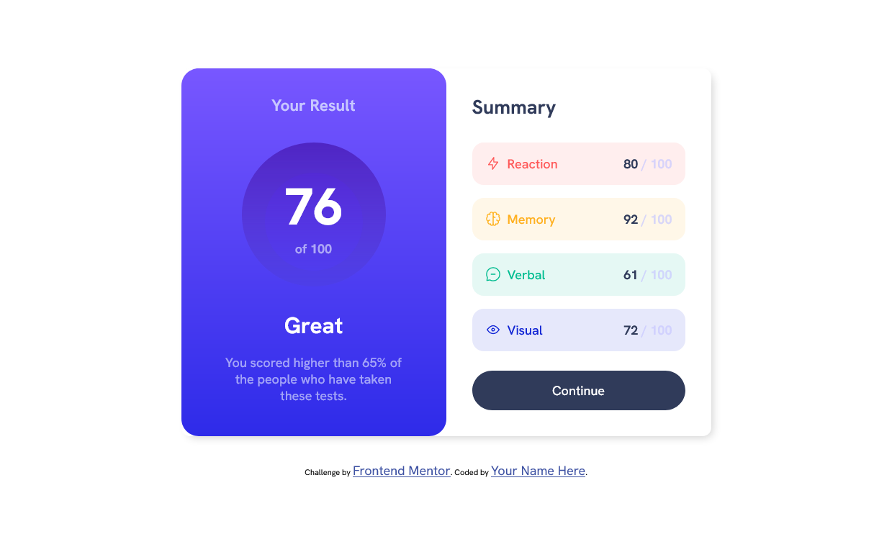
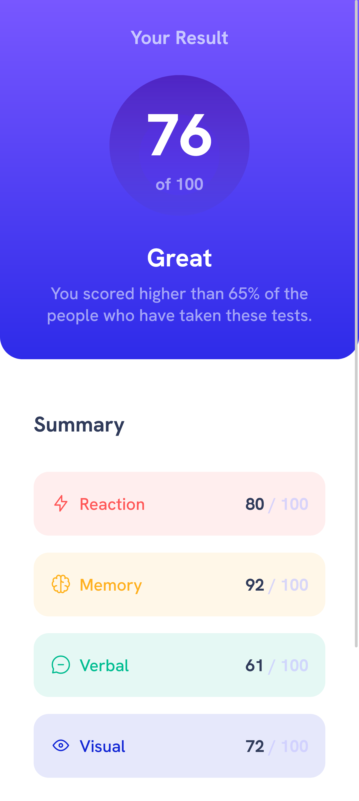

# Frontend Mentor - Results summary component solution

This is a solution to the [Results summary component challenge on Frontend Mentor](https://www.frontendmentor.io/challenges/results-summary-component-CE_K6s0maV). Frontend Mentor challenges help you improve your coding skills by building realistic projects. 

## Table of contents

- [Overview](#overview)
  - [The challenge](#the-challenge)
  - [Screenshot](#screenshot)
  - [Links](#links)
- [My process](#my-process)
  - [Built with](#built-with)
  - [What I learned](#what-i-learned)
  - [Useful resources](#useful-resources)
- [Author](#author)

## Overview

### The challenge

Users should be able to:

- View the optimal layout for the interface depending on their device's screen size
- See hover and focus states for all interactive elements on the page

### Screenshot

Desktop:


Mobile:


### Links

- Solution URL: [Add solution URL here](https://www.frontendmentor.io/challenges/results-summary-component-CE_K6s0maV/hub)
- Live Site URL: [Add live site URL here](https://your-live-site-url.com)

## My process

### Built with

- HTML5
- CSS Flexbox
- CSS Media Queries
- Mobile-first workflow

### What I learned
I learned to create mobile-first layout and responsive design using media queries.
I used these styles for proper mobile view in landscape mode:
```css
@media screen and (orientation: landscape) and (min-width: 736px) and (max-height: 500px) {
    body {
        justify-content: unset;
        max-height: 100%;
    }

    .main {
        margin-top: 1rem;
    }
}
```

### Useful resources

- [MDN](https://developer.mozilla.org/en-US/)
- [Stackoverflow](https://stackoverflow.com/questions)
- [CSS Shadow generator](https://www.cssmatic.com/box-shadow)
- [Using SVG](https://css-tricks.com/using-svg/)

## Author

- Website - [@nextcorp](https://nextcorp.github.io/)
- Frontend Mentor - [@nextcorp](https://www.frontendmentor.io/profile/nextcorp)

